# Event Manager - 大事件内容管理系统

> 基于 **Vue 3 + Vite** 构建的企业级内容管理后台系统，涵盖文章管理、分类管理、用户中心及 AI 智能助手等核心模块，采用现代化技术栈与工程化规范。

* 项目演示地址： [https://luluuu060.github.io/vue3-Event_Manager/]

## 目录

- [一、技术栈](#一技术栈)
- [二、项目预览](#二项目预览)
- [三、功能模块详解](#三功能模块详解)
- [四、项目结构](#四项目结构)
- [五、技术亮点](#五技术亮点)
- [六、快速开始](#六快速开始)
- [七、部署](#七部署)
- [八、后端接口](#八后端接口)
- [九、项目规范](#九项目规范)
- [十、开发记录](#十开发记录)

---

## 一、技术栈

| 分类 | 技术 | 版本 | 职责 |
| :--- | :--- | :--- | :--- |
| 核心框架 | Vue 3（Composition API + `<script setup>`） | ^3.4.0 | 视图层核心，响应式数据管理 |
| 构建工具 | Vite | ^4.3.9 | 快速构建与热更新 |
| 路由 | Vue Router 4（Hash 模式 + 路由守卫） | ^4.2.2 | 页面路由管理与权限控制 |
| 状态管理 | Pinia（+ pinia-plugin-persistedstate） | ^2.1.3 | 全局状态管理与 Token 持久化 |
| UI 框架 | Element Plus（按需自动导入） | ^2.14.2 | UI 组件库 |
| 富文本编辑器 | @vueup/vue-quill | ^1.5.5 | 文章内容编辑 |
| HTTP 请求 | Axios（统一封装拦截器） | ^1.18.1 | 网络请求层 |
| 样式方案 | SCSS（CSS 变量主题 + 响应式布局） | ^1.101.0 | 样式管理 |
| 代码规范 | ESLint + Prettier + Husky + lint-staged | - | 代码质量保障 |
| AI 接口 | 智谱 GLM-4（Mock + 真实 API 模式） | - | AI 问答 |
| 包管理 | pnpm | ^8.0 | 依赖管理 |

---

## 二、项目预览

### 2.1 登录页面

**注册模式**

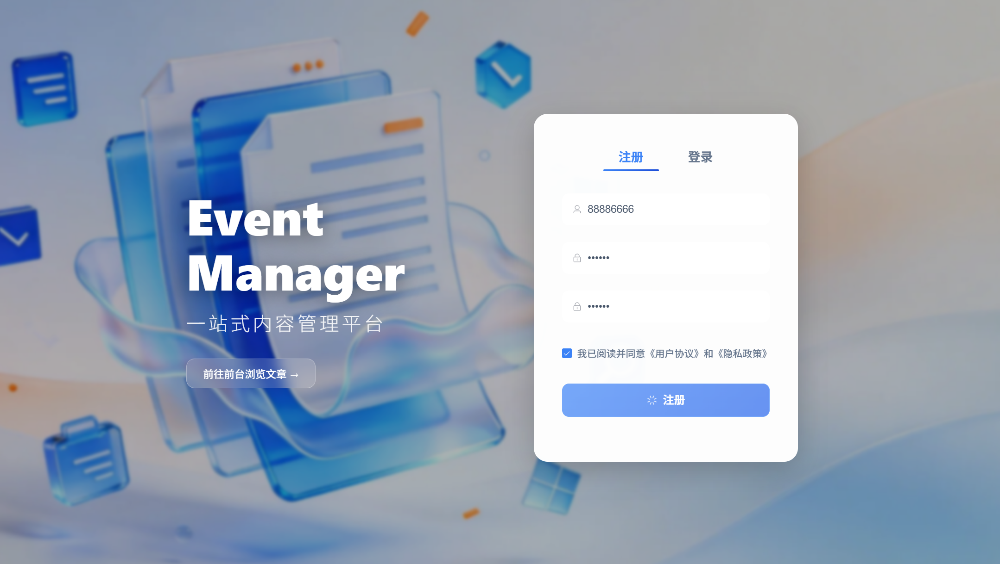

**登录模式**

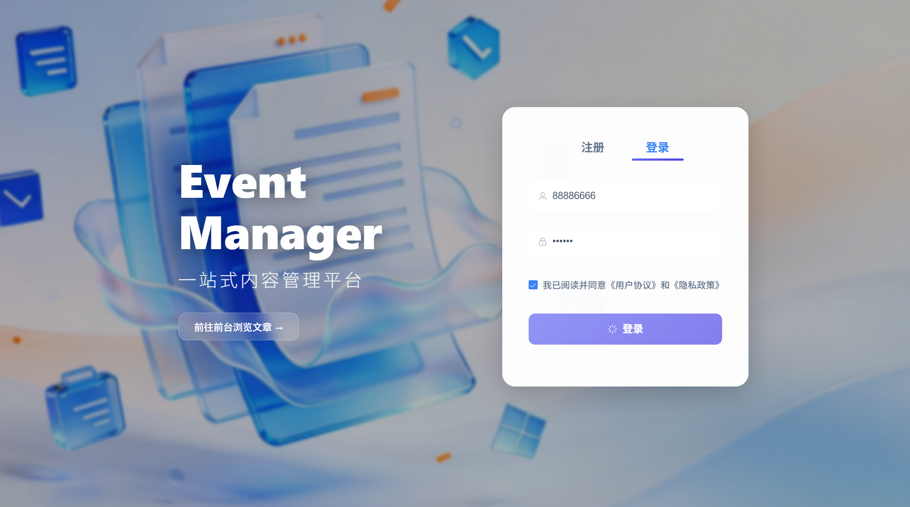

- 注册模式：包含用户名/密码/确认密码输入框和注册按钮
- 登录模式：包含用户名/密码输入框、记住我和登录按钮

### 2.2 文章管理页面

**文章列表**

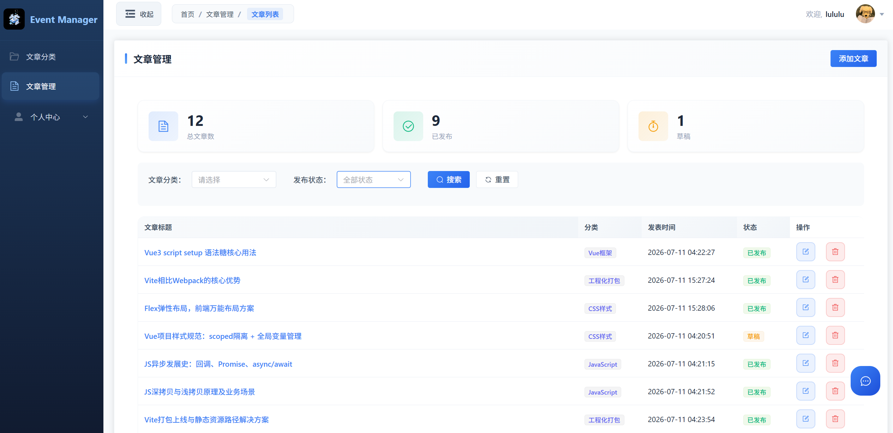

**编辑/添加文章**

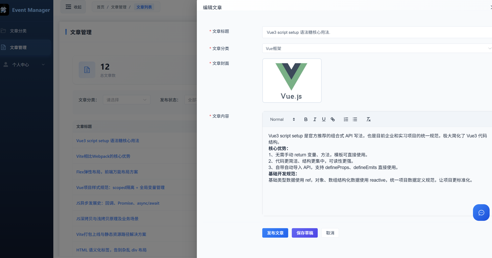

- 文章列表：展示文章数据，支持分页和分类筛选
- 编辑/添加文章：抽屉式表单，支持封面上传与富文本编辑

### 2.3 分类管理页面

**分类列表**

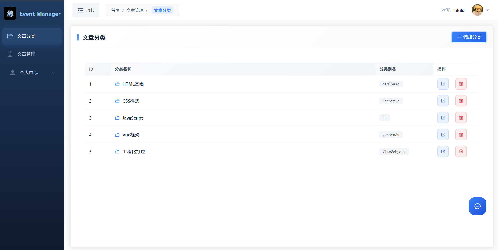

**新增/编辑分类**

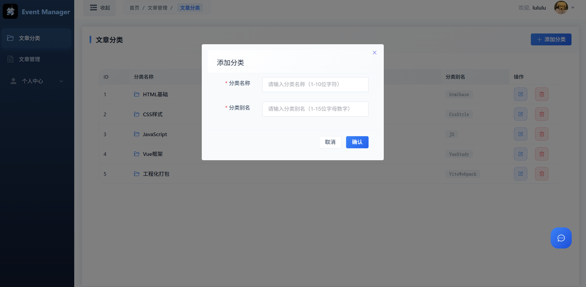

- 分类列表：展示分类数据，支持分页
- 新增/编辑分类：弹窗式表单，支持表单校验

### 2.4 个人中心页面

**基本资料**

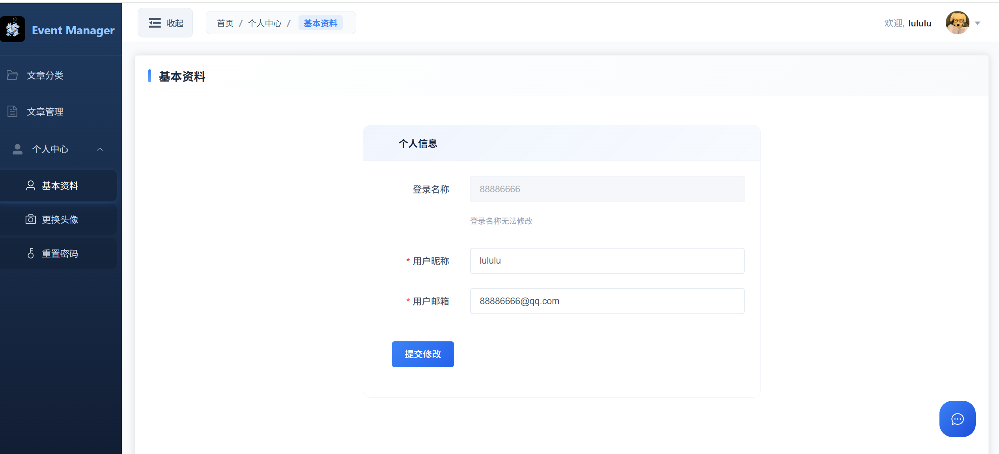

**头像上传**

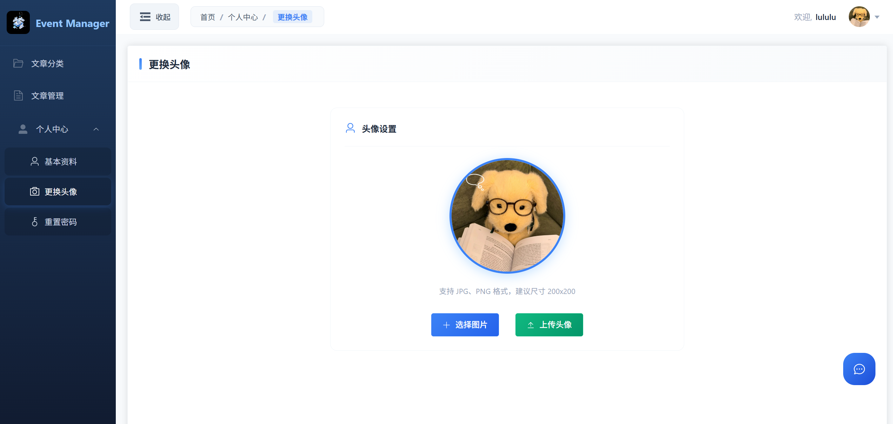

**密码修改**

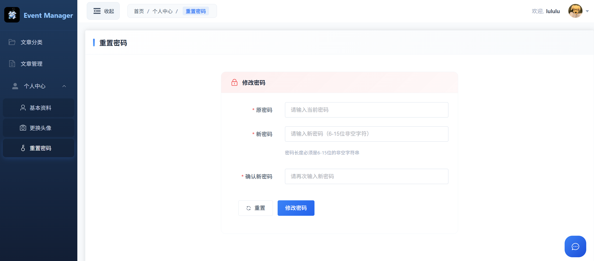

- 基本资料：修改昵称和邮箱
- 头像上传：支持实时预览和 Base64 编码上传
- 密码修改：原密码校验 + 新密码确认

### 2.5 AI 智能助手

| 聊天对话 | 快捷提问 |
| :---: | :---: |
| 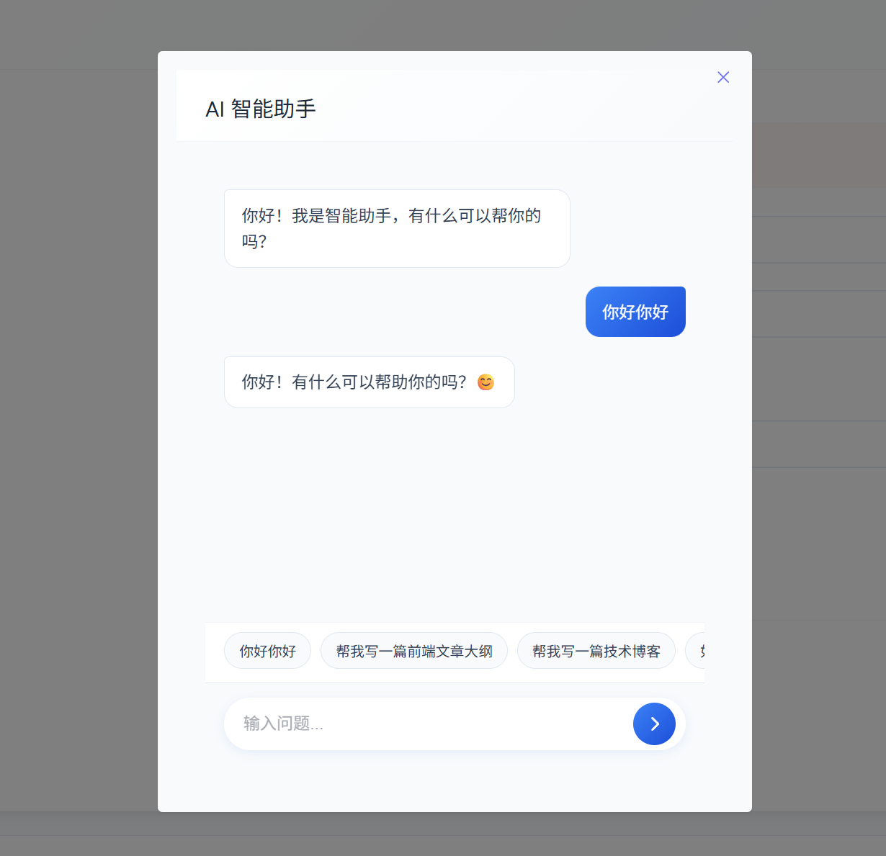 | 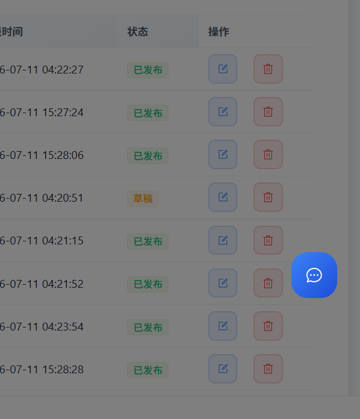 |

- 聊天对话界面：显示 AI 回复内容
- 快捷提问标签：随机推荐问题

---

## 三、功能模块详解

### 3.1 用户认证模块

| 核心功能 | 关键技术点 |
| :--- | :--- |
| 登录 / 注册 / 退出登录 | `router.beforeEach` 全局路由守卫 |
| 表单校验（用户名 5-10 位、密码 6-12 位字母数字、确认密码一致性） | Element Plus `el-form` 组件表单校验 |
| Token 持久化存储 | Pinia + localStorage（`pinia-plugin-persistedstate`） |
| 路由前置守卫拦截 | 未登录自动跳转登录页 |
| 支持 Vue2 前台双向跳转 | URL 携带 `from` 参数，目标页面检测后清除 Token |

```
用户访问页面 → 路由守卫检查 Token → 未登录 → 跳转登录页
                                        ↓
                                   登录/注册 → 表单验证 → 调用 API → 验证通过 → 存储 Token → 跳转首页
                                        ↓
                                   验证失败 → 提示错误信息
```

### 3.2 文章管理模块

| 核心功能 | 关键技术点 |
| :--- | :--- |
| 文章列表展示（分页、按分类/状态筛选） | Element Plus `el-table` + 分页组件 |
| 文章新增 / 编辑（抽屉式表单，支持封面上传与富文本编辑） | FormData 提交、`@vueup/vue-quill` 富文本编辑器 |
| 文章删除（带二次确认弹窗） | Element Plus `el-dialog` 弹窗组件 |
| 统计卡片（总文章数、已发布数、草稿数） | 响应式数据实时计算 |
| 封面图片预览与文件上传 | FileReader API 实现预览 |
| 网络图片转 File 对象（编辑回显） | fetch 获取图片 → Blob → File 转换 |

```
文章列表页 ←→ 筛选/搜索 ←→ 分页切换
    ↓
新增文章 → 填写表单 → 上传封面 → 富文本编辑 → 保存（FormData）
    ↓
编辑文章 → 加载已有数据 → 网络图片转 File → 修改内容 → 更新保存
    ↓
删除文章 → 二次确认弹窗 → 删除成功/失败提示
```

### 3.3 分类管理模块

| 核心功能 | 关键技术点 |
| :--- | :--- |
| 分类列表展示（支持分页） | Element Plus `el-table` + 分页组件 |
| 分类新增 / 编辑 / 删除（弹窗式表单） | Element Plus `el-dialog` 弹窗组件 |
| 表单校验（分类名 1-10 位、别名 1-15 位字母数字） | Element Plus `el-form` 表单校验 |

```
分类列表 → 新增分类 → 填写名称/别名 → 表单验证 → 提交
            ↓
         编辑分类 → 弹窗加载数据 → 修改信息 → 提交
            ↓
         删除分类 → 确认删除 → 操作完成提示
```

### 3.4 个人中心模块

| 核心功能 | 关键技术点 |
| :--- | :--- |
| 基本资料修改（昵称、邮箱） | Element Plus `el-form` 表单校验 |
| 头像上传（Base64 格式，实时预览） | FileReader API + Base64 编码 |
| 密码重置（原密码校验 + 新密码确认） | Element Plus `el-form` 自定义校验规则 |
| 修改密码后强制重新登录 | 主动清除 Token 并跳转登录页 |

```
个人中心 → 基本资料 → 修改昵称/邮箱 → 表单验证 → 保存 → 更新 Store
            ↓
         更换头像 → 选择图片 → 实时预览 → Base64 编码 → 上传
            ↓
         修改密码 → 输入原密码 → 输入新密码 → 确认密码 → 提交 → 重新登录
```

### 3.5 AI 智能助手模块

| 核心功能 | 关键技术点 |
| :--- | :--- |
| 悬浮按钮入口 + 弹窗式对话界面 | Element Plus `el-dialog` 弹窗组件 |
| 流式逐字输出（打字机效果） | 响应式代理对象实现实时渲染 |
| 快捷问题随机推荐（3-4 个） | 随机数组抽取 |
| 支持 Mock 模式与真实 API 模式切换 | 环境变量配置检测 |
| 历史记录管理 | localStorage 存储 |

```
点击悬浮按钮 → 打开对话弹窗 → 随机展示快捷问题
    ↓
输入问题 / 点击快捷问题 → 发送请求 → 逐字回调 → 实时显示回复
    ↓
继续对话 / 关闭弹窗
```

### 3.6 布局与交互模块

| 核心功能 | 关键技术点 |
| :--- | :--- |
| 侧边栏可折叠（收起/展开动画，折叠后仅显示图标） | CSS 过渡动画 |
| 顶部导航栏（面包屑 + 用户下拉菜单） | Element Plus `el-breadcrumb` + `el-dropdown` |
| 响应式布局适配（移动端适配） | `@media` 响应式布局 |
| 全局主题色系统（CSS 变量统一管理） | CSS 变量 + `:deep()` 样式穿透 |

---

## 四、项目结构

```
src/
├── api/                    # API 接口封装（按业务模块分组）
│   ├── ai.js               # AI 对话接口（Mock + 真实 API）
│   ├── article.js          # 文章与分类接口
│   └── user.js             # 用户认证与个人中心接口
├── assets/                 # 静态资源
│   ├── bg.png              # 登录页背景图
│   ├── default.png         # 默认头像
│   ├── logo.jpg            # Logo
│   └── main.scss           # 全局样式（CSS 变量 + 组件覆盖）
├── components/             # 公共组件
│   └── AIAssistant.vue     # AI 智能助手组件
├── router/
│   └── index.js            # 路由规则 + 前置守卫
├── stores/                 # Pinia 状态管理
│   ├── modules/
│   │   └── user.js         # 用户状态（Token + 用户信息）
│   └── index.js            # Pinia 实例（持久化插件）
├── utils/
│   ├── request.js          # Axios 封装（拦截器 + 错误处理）
│   └── format.js           # 时间格式化工具
├── views/                  # 页面组件
│   ├── article/            # 文章模块
│   │   ├── components/     # 文章相关子组件
│   │   │   ├── ArticleEdit.vue    # 文章编辑抽屉
│   │   │   ├── ChannelEdit.vue    # 分类编辑弹窗
│   │   │   ├── ChannelSelect.vue  # 分类选择器
│   │   │   └── PageContainer.vue  # 页面容器
│   │   ├── ArticleChannel.vue     # 文章分类页面
│   │   └── ArticleManage.vue      # 文章管理页面
│   ├── layout/
│   │   └── LayoutContainer.vue    # 主布局（侧边栏 + 顶部导航）
│   ├── login/
│   │   └── LoginPage.vue   # 登录/注册页面
│   └── user/               # 个人中心
│       ├── UserAvatar.vue  # 头像上传页面
│       ├── UserPassword.vue # 密码修改页面
│       └── UserProfile.vue # 基本资料页面
├── App.vue                 # 根组件
└── main.js                 # 应用入口
```

---

## 五、技术亮点

| 技术分类 | 实现方式 | 收益 |
| :--- | :--- | :--- |
| 按需自动导入 | `unplugin-auto-import` + `unplugin-vue-components` | Element Plus 组件和 API 按需导入，减少打包体积 |
| 代码规范 | ESLint + Prettier + Husky + lint-staged | 提交前自动校验与格式化，保证代码质量 |
| 路径别名 | Vite 配置 `@` 指向 `src` 目录 | 简化导入路径，提高可维护性 |
| 状态管理 | Pinia + `pinia-plugin-persistedstate` | 组合式 Store 写法，Token 自动持久化 |
| 请求层封装 | Axios 拦截器（请求/响应） | 统一错误处理、401 自动跳转、数据剥离 |
| FormData 文件上传 | 文章封面通过 FormData 提交 | 支持文件上传与编辑回显 |
| 网络图片转 File | fetch 获取图片 → Blob → File | 编辑模式下重新提交网络图片 |
| 流式 AI 对话 | 逐字回调 + 打字机效果 | 使用响应式代理对象实时渲染，避免 Vue 响应式失效 |
| 样式方案 | SCSS 嵌套语法 + `:deep()` 穿透覆盖 Element Plus 组件样式 + CSS 变量主题（#3b82f6） | 结构清晰，避免样式污染，统一主题色 |

---

## 六、快速开始

### 6.1 环境要求

| 依赖 | 版本要求 |
| :--- | :--- |
| Node.js | >= 16 |
| pnpm | >= 8 |

### 6.2 安装与运行

```bash
pnpm install
pnpm dev
pnpm build
pnpm preview
pnpm lint
```

### 6.3 测试账号

- 用户名：`88886666`
- 密码：`123456`

### 6.4 环境变量

在项目根目录创建 `.env` 文件配置 AI 助手 API：

```env
VITE_AI_API_URL=your_api_url
VITE_AI_API_KEY=your_api_key
VITE_AI_MODEL=your_model_name
```

> 未配置时 AI 助手自动切换为 Mock 模式。

---

## 七、部署

### GitHub Pages 部署

1. 在 `vite.config.js` 中设置 `base` 为仓库名
2. 在 `public/` 目录下添加 `.nojekyll` 文件（避免 Jekyll 忽略下划线文件）
3. 执行 `pnpm build`，将 `dist/` 目录部署到 GitHub Pages

---

## 八、后端接口

本项目使用传智播客提供的大事件后端接口：
- 接口地址：`https://big-event-vue-api-t.itheima.net`
- 认证方式：请求头 `Authorization` 携带 Token
- 主要接口：登录注册、文章列表 / 详情 / 分类、用户资料 / 头像 / 密码

---

## 九、项目规范

### 9.1 文件命名规范

| 类型 | 命名规则 | 示例 |
| :--- | :--- | :--- |
| 组件文件 | PascalCase | `ArticleManage.vue` |
| API 文件 | kebab-case | `user.js` |
| 工具函数 | kebab-case | `request.js` |
| 样式文件 | kebab-case | `main.scss` |

### 9.2 代码组织规范

**Vue 组件 `<script setup>` 顺序：** 导入语句 → 响应式数据 → 表单校验规则 → 组件引用 → 方法定义 → 生命周期调用

**API 模块顺序：** 按业务逻辑分组，同一组内按 CRUD 操作排序

**工具模块顺序：** 常量定义 → 配置对象 → 核心函数 → 导出

---

## 十、开发记录

### 10.1 问题与解决方案

| 问题 | 解决方案 | 技术原理 |
| :--- | :--- | :--- |
| GitHub Pages 图片 404 | 将截图放到项目根目录 `screenshots/`，使用相对路径 | 原路径 `docs/screenshots/` 未推送到 GitHub |
| AI 响应渲染延迟 | 使用响应式代理对象追加内容 | Vue 响应式系统仅对代理对象生效 |
| Element Plus 样式穿透 | 全局样式 + 特定类名隔离 | `append-to-body` 弹窗脱离组件作用域 |
| Vue2/Vue3 跳转状态残留 | URL 携带 `from` 参数，目标页面检测后清除 Token | 不同端口 localStorage 隔离 |
| 表单布局对齐 | 设置 `.el-form-item__content` `margin-left: 0` | 去除默认标签宽度偏移 |

### 10.2 优化方向

- [ ] 接入真实 AI 流式 API（当前为 Mock 模式）
- [ ] 增加页面缓存策略，减少重复请求
- [ ] 实现暗黑模式切换
- [ ] 添加单元测试覆盖核心功能
- [ ] Vue2 前台项目增加搜索和分类筛选功能
